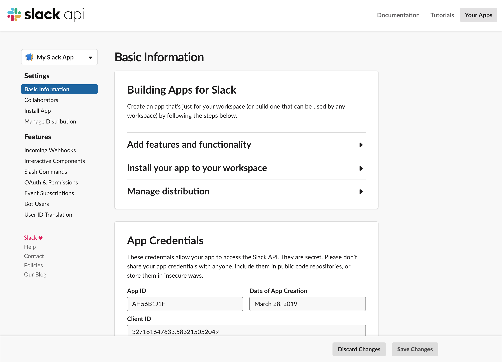
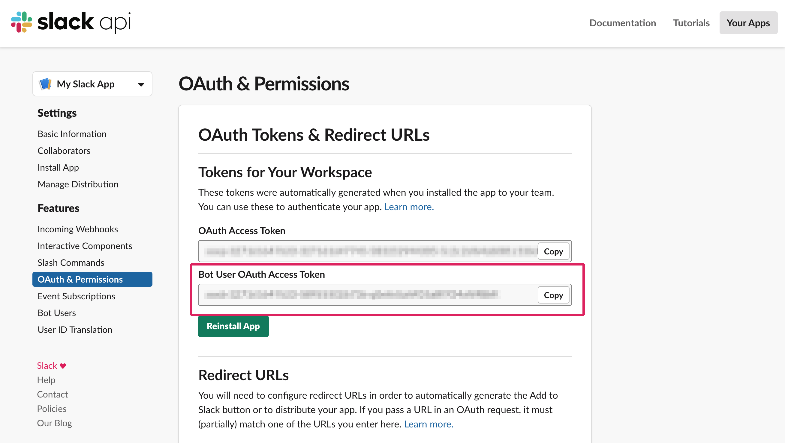
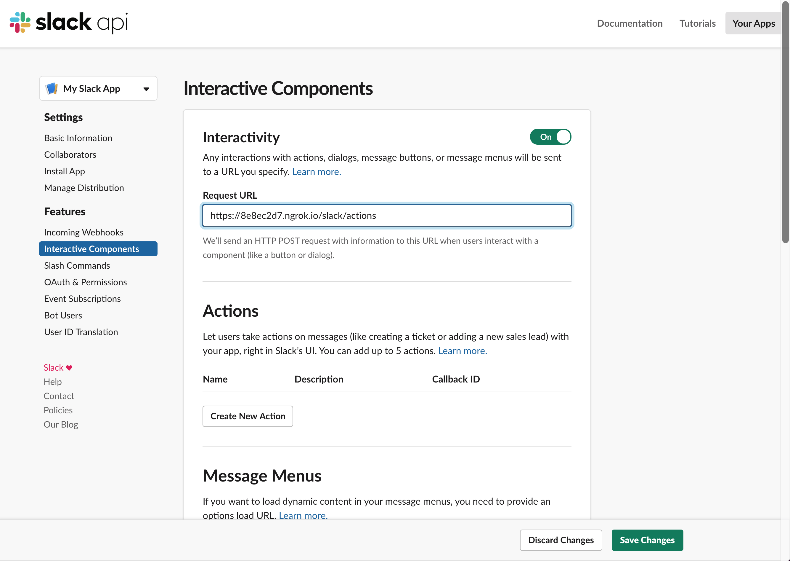

<div class="section-content">
# Getting started
This guide is meant to show you how to get up and running with your first Bolt app. Along the way, we’ll create a new Slack app, set up your local environment, and develop an app that listens and responds to messages from a Slack workspace.
</div> 

<div class="supporting-content">
- [Create an app](#create-an-app)
- [Tokens and installing apps](#tokens-and-installing-apps)
- [Setting up your local project](#setting-up-your-local-project)
- [Setting up events](#setting-up-events)
- [Listening and responding to a message](#listening-and-responding-to-a-message)
- [Sending and responding to actions](#sending-and-responding-to-actions)
- [Next steps](#next-steps)
</div>

---

### Create an app
First thing's first: before you start developing with Bolt, you'll need to [create an app](https://api.slack.com/apps/new). After you fill out an App Name (_you can change it later_) and picking a workspace to install it to, hit the `Create App` button and you'll land on your app's **Basic Information** page.

> 💡 We recommend using a workspace where you won't disrupt real work getting done — you can create a new one for free.

This page contains links to add features and functionality to your app in addition to important credentials you'll need for development later, like the `Signing Secret` under **App Crendentials**.



Look around, add an app icon and description, and then let's start configuring your app 🔩

---

### Tokens and installing apps
You have two major options for tokens: user (`xoxp`) tokens and bot (`xoxb`) tokens. User tokens allow you to call Web API methods on behalf of users based on OAuth scopes and bot tokens require a bot user, which has default permissions similar to a standard user.

You can learn more about the different token types [on our API site](https://api.slack.com/docs/token-types). The type of token your app needs depends on the actions you want it to perform. But for brevity, we're going to use bot tokens for this guide.

To add a bot user, click **Bot Users** on the left sidebar and then **Add A Bot User**. Give it a display name and username and then click **Add Bot User**.

Now that you have a bot user with permission to send messages to Slack, let's install the app to your workspace.

Click **Install App** on the left sidebar and click the big **Install App to Workspace** button at the top of the page. Once you authorize the installation, you'll land on the **OAuth & Permissions** page.



You'll see two tokens. To add scopes to the `xoxp` tokens, you can scroll down to the **Scopes** section. For now, we'll just use the `xoxb` bot token.

> 💡 Treat your token like a password and keep it safe. Your app uses it to post and retrieve information from your Slack.

You'll need your token to use any of the [Web API methods](https://api.slack.com/methods).

### Setting up your local project
If you don’t already have a project, let’s create a new one. Create an empty directory and initalize a new project:

```shell
mkdir myapp
cd myapp
npm init
```

You’ll be prompted with a series of questions to describe your project, and you can accept the defaults if you aren’t picky. After you’re done, you’ll have a new `package.json` file in your directory.

Before we install the Bolt package to your new project, let's save the bot token and signing secret from the first two sections:

1. **Copy your Signing Secret from the Basic Information page** and then store it in a new environment variable. The following example works on Linux and MacOS; but [similar commands are available on Windows](https://superuser.com/questions/212150/how-to-set-env-variable-in-windows-cmd-line/212153#212153).

```shell
export SLACK_SIGNING_SECRET=<your-signing-secret>
```

2. **Copy your bot (xoxb) token from the OAuth & Permissions page** and store it in another enviornment variable.

```shell
export SLACK_BOT_TOKEN=xoxb-<your-bot-token>
```

Now, lets create your app. Install the `@slack/bolt` package and save it to your `package.json` dependencies using the following command:

```shell
npm install @slack/bolt
```

Create a new file called `app.js` in this directory and add the following code:

```javascript
const { App } = require('@slack/bolt');

// Initalizes your app with your bot token and signing secret
const app = new App({
  token: process.env.SLACK_BOT_TOKEN,
  signingSecret: process.env.SLACK_SIGNING_SECRET
});

const port = process.env.PORT || 3000;

// Starts your app
(async () => {
  await app.start(port);

  console.log('Your Bolt ⚡ app is up and running');
});
```

Your token and signing secret are all that's required to create your first Bolt app. Save your `app.js` file then, back at the command line, run the following:

```script
node app.js
```

Your app should let you know that it's up and running.

---

### Setting up events
To listen to events happening in Slack (like when a reaction is added, or a message is posted) you'll need to enable events for your app.

Start by going back to your app configuration page (click on your app [from your app management page](https://api.slack.com/apps)). Click **Event Subscriptions** on the left sidebar. Toggle the switch labeled **Enable Events**. You'll see a text input labeled "Request URL".

A Request URL is a public URL where Slack can send HTTP post requests.

When an event occurs in a workspace where your app is installed, Slack will send your app information about the event, like the user that triggered it and the channel it occured in.

#### Using a local Request URL for development
If you’re just getting started with your app development, you probably don’t have a publicly accessible URL yet. Eventually, you’ll want to set that up, but for now a development proxy like [ngrok](https://ngrok.com/) will do the job.

Once you’ve installed a development proxy, run it to begin forwarding requests to a specific port (we’re using port 3000 for this example, but if you customized the port used to intialize your app use that port instead):

```shell
ngrok http 3000
```


The output should show a generated URL that you can use (we recommend the one that starts with `https://`). This URL will be the base of your request URL, in this case `https://8e8ec2d7.ngrok.io`.

Okay, so at this point you should have some kind of public-facing URL. The request URL is composed of your public-facing URL combined with the endpoint your app is listening on. By default, Bolt apps listen on the `/slack/events` endpoint so our full request URL would be `https://8e8ec2d7.ngrok.io/slack/events`.

Under the **Enable Events** switch in the **Request URL** box, go ahead and paste in your URL. As long as your Bolt app is still running, your endpoint should become verified.

---

### Listening and responding to a message
Your app is now ready for some logic. Let's start by using the `message()` method that listens to messages in channels your bot user is a member of.

The following example listens to all messages that contain the word "hello" and responds with "Hey there @user!"

```javascript
const { App } = require('@slack/bolt');

const app = new App({
  token: process.env.SLACK_BOT_TOKEN,
  signingSecret: process.env.SLACK_SIGNING_SECRET
});

// Listens to incoming messages that contain "hello"
app.message('hello', ({ message, say }) => {
  // say() sends a message to the channel where the event was triggered
  say(`Hey there <@{message.user}!`);
});

const port = process.env.PORT || 3000;

(async () => {
  await app.start(port);

  console.log('Your Bolt ⚡ app is up and running');
});
```

If you restart your app, you should be able to add your bot user to a channel, say "hello", and it will respond.

This is a basic example, but it gives you a place to start customizing your app based on your end goal. Let's try something a little more interactive by sending an interactive button rather than plain text.

---

### Sending and responding to actions

To use features like buttons, select menus, datepickers, dialogs, or message actions, you’ll need to enable interactivity. This is similar to enabling interactivity for events above.

Back on your app configuration page, click on **Interactive Components** on the left side. You'll see that there's another **Request URL** box.

Unless you specified your own endpoints, use *the same* request URL as above (in the example, it was `https://8e8ec2d7.ngrok.io/slack/events`). Press the **Save Changes** button in the lower right hand corner, and that's it. Interactivity is enabled!



Now, let's go back to your app's code and add our own interactivity. I'll break this into two steps: first, I'll send a message that _contains a button_. Then we'll set up a listener that is called when the button is clicked.

Below, I've modified the app code we've been writing to send a message with a button instead of a just sending a string:

```javascript
const { App } = require('@slack/bolt');

const app = new App({
  token: process.env.SLACK_BOT_TOKEN,
  signingSecret: process.env.SLACK_SIGNING_SECRET
});

// Listens to incoming messages that contain "hello"
app.message('hello', ({ message, say }) => {
  // say() sends a message to the channel where the event was triggered
  say({
    blocks: [
	    {
		    "type": "section",
        "text": {
          "type": "plain_text",
          "text": `Hey there <@{message.user}!`
        },
        "accessory": {
          "type": "button",
          "text": {
            "type": "plain_text",
            "text": "Click Me"
          },
          "action_id": "button_click"
		    }
	    }
    ]
  });
});

const port = process.env.PORT || 3000;

(async () => {
  await app.start(port);

  console.log('Your Bolt ⚡ app is up and running');
});
```

The value inside of `say()` is now an object that contains an array of `blocks`. Blocks are the building components of a Slack message and can range from text to images to datepickers. I've added a section block with a button as an accessory.

You'll notice in the same `accessory` object as the button, there is an `action_id`. This will act as a unique identifier for the action so your app knows what action you want to respond to.

> 💡 The [Block Kit Builder](https://api.slack.com/tools/block-kit-builder) is an easy way to prototype your interactive messages. You can copy and paste the message payload directly into your Bolt app.

Now, if you restart your app and say "hello" in a channel your app is in, you'll see a message with a button. But if you click the button, nothing happens.

Let's add a handler to send a followup message when someone clicks the button:

```javascript
const { App } = require('@slack/bolt');

const app = new App({
  token: process.env.SLACK_BOT_TOKEN,
  signingSecret: process.env.SLACK_SIGNING_SECRET
});

// Listens to incoming messages that contain "hello"
app.message('hello', ({ message, say }) => {
  // say() sends a message to the channel where the event was triggered
  say({
    blocks: [
	    {
		    "type": "section",
        "text": {
          "type": "plain_text",
          "text": `Hey there <@{message.user}!`
        },
        "accessory": {
          "type": "button",
          "text": {
            "type": "plain_text",
            "text": "Click Me"
          },
          "action_id": "button_click"
		    }
	    }
    ]
  });
});

app.action('button_click', ({ action, say }) {
  say(`@{action.user} clicked the button`);
});

const port = process.env.PORT || 3000;

(async () => {
  await app.start(port);

  console.log('Your Bolt ⚡ app is up and running');
});
```

You can see that we used the `action_id` to add a listener for our button action. If you restart your app and click the button, you'll see a new message from your app that says you clicked the button.

---

### Next steps
You just built your first Bolt app! 🎉

Now that you have a basic app up and running, you can start exploring the parts of Bolt that will make your app stand out. Here are some ideas about where to look next:

* Read through the [Basic concepts](https://slack.dev/bolt#basic) to learn about the different methods and features your Bolt app has access to.

* Explore the different events your bot can listen to with the [`events()` method](https://slack.dev/bolt#event-listening). All of the events are listed [on the API site](https://api.slack.com/events).

* Bolt allows you to [call Web API methods](https://slack.dev/bolt#web-api) with the client attached to your app. There are [over 130 methods](https://api.slack.com/methods) on our API site.


